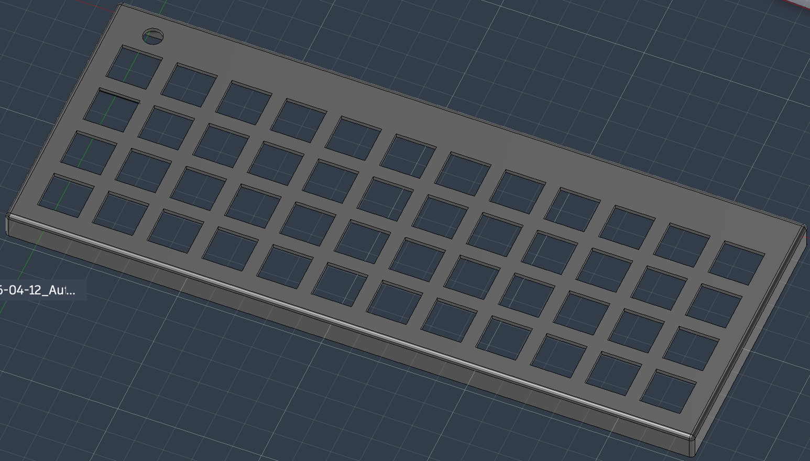

# Liteboard
Liteboard is a keyboard with total 40 key,it is super lite....and functional
3D-printable,super kinda lite(no RGB support lol)

## Features:
- 40 keys 12x4 layout
- Lite weight and **only 1.3cm thick**
- An volume knob
- haptic feedback support by the....wait iPhone haptic engine?
## BOM:
[liteboard-bom.csv]("./bom/liteboard-bom.csv")
MIWU-MINI:an Chinese company ,i found it on Taobao.idk if findable on AliExpress (i bought on taobao)
any Low shaft switch i think is okay.
no taxes no shipping,for 1.37$.

HDR-M_2.54_2x1:a pin header,connecting the haptic engine.

## Software:
[source-code](./firmware/main.py)
use kmk firmware,see https://github.com/KMKfw/kmk_firmware/ for more informaion.
not finished yet..

## Printing:
PLA,White
